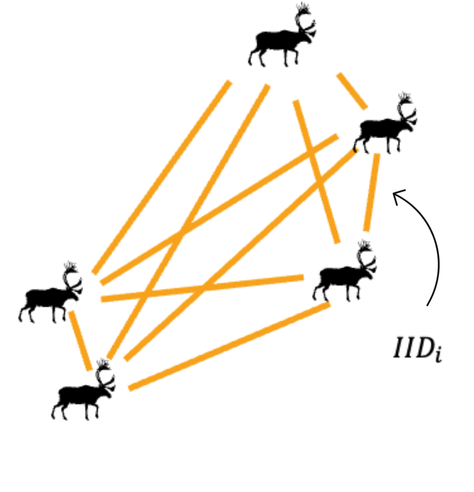
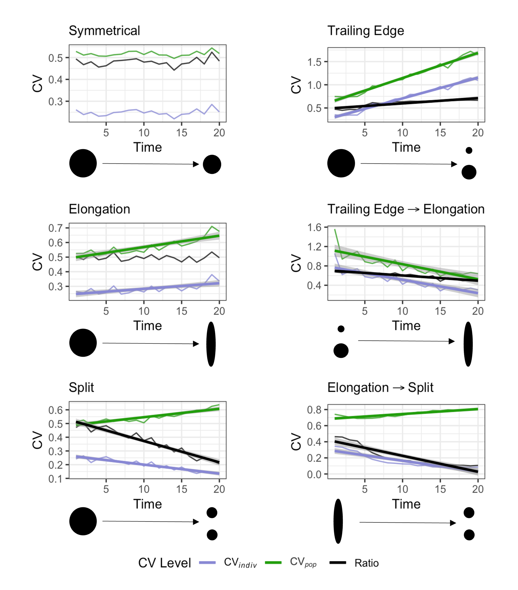

```{r, include = FALSE}
knitr::opts_chunk$set(
  fig.align="center",
  fig.border='none'
)
library(dplyr)
library(magrittr)
library(ggplot2)
library(scales)
```

<style>
    img {
        border: 0;
    }
</style>

## Background

This package was motivated by working with an animal telemetry dataset
that spanned decades. We wanted to measure the link between spatial
distribution and cohesion in group, but were limited to only location
data. After some tinkering and reading the literature, we discovered
that measuring the distances between pairs of individuals offered a
promising way to understand this relationship.

The degree of social cohesion across a group depends on the distance
between individuals, because greater separation reduces their ability to
coordinate their actions.Their spacing reflects a balance between
attraction (safety in numbers or finding mates) and repulsion (avoiding
competition). When population size or habitat conditions change, that
balance can shift—leading to changes in how the group is spaced out, and
even in the shape of their overall range (like shrinking, stretching, or
splitting apart).

```{r visualize IIDs, fig.align='center', echo=FALSE, dpi = 800,out.width="30%", echo = FALSE}

# <div style="text-align:center">
#   
#   <p><em>Visual Representation of IIDs</em></p>
# </div>
# put this outside code chunk if still not working

```


Determining the range and spatial density of individuals fully requires
extensive sampling. Our method adds to the existing toolkit of spatial
analysis by offering summary statistics that require less sampling to
describe key features of a population's range and detect changes over
time in spatial use. We use two different measures of the coefficient of
variation (CV) in IID: individual-level and population-level. Both
provide a scale-free measure that stays constant if density changes
without changing the spatial distribution, or if the range changes
symmetrically as the population shifts. However, changes in range shape
and/or splitting into subpopulations alter these two CV measures, and
their ratio, in distinct ways:

```{r visualize simulations, fig.align='center', echo=FALSE, dpi = 800,out.width="70%", echo = FALSE}

# <div style="text-align:center">
#   }}images/cvsims.png" width="30%">
#   <p><em>Simulations of CVs</em></p>
# </div>

```

For the full description of the method and its application, see: Love &
Otto (2025). *Spatial Signatures of Population Cohesion*. Methods in
Ecology and Evolution. <https://doi.org/>

## CV functions

This package has two streams of functions depending on the type of
input.

### Stream 1: non-sf data

If you have Cartesian coordinates in separate columns or vectors whose
distances are not substantially far enough apart to account for the
curvature of the earth, use `cvpop()`, `cvind()` and `cvatio()`. These
functions produce a numeric value, or if used within dplyr verbs, a
column, where each row contains the CV of IID for a given sampling unit
(time, season, site).

-   `cvpop`: calculates the population-level CV of inter-individual
    distances (CV of all distances between all pairs of individuals)
-   `cvind`: calculates the individual-level CV of inter-individual
    distances (CV of the average inter-individual distance across all
    individuals)
-   `cvratio`: calculates the ratio of individual-level CV to
    population-level CV

Consider, as an example, a population with 10 individuals that has been
sampled five times in one day for two years. The dataset includes the
location ("x", "y"), the year sampled ("year"), the identification of
the individual sampled ("id"), and for illustrative purposes, a column
containing data but not relevant to these functions ("random").


```{r non-sf functions}
library(shapeshiftr)
head(split_population)
```


The data is spread across multiple years, we will use our CV functions
in a pipe where the dataframe is grouped by year.


```{r calculate CV metrics}
sp <- split_population %>% group_by(year) %>% 
                      summarise(pop = cvpop(across(c(x,y))), 
                                ind = cvind(across(c(x,y))), 
                                ratio = cvratio(across(c(x,y)))) 
sp
```


From year 1 to year 2, the population-level CV has increased while the
individual-level CV and the ratio has decreased, which is indicative of
population fragmentation. Let's visualize the data to check:


```{r visualize non-sf data, dpi = 300}
ggplot(split_population, aes(x,y)) +
  geom_point(aes(color = as.factor(year))) +
  theme_bw() +
  labs(color = "year")+
  coord_equal(xlim = c(0, 100))
```

We can see that the population has split from into two subpopulations
from year 1 to year 2.

### Stream 2: `sf` data

If you have a dataframe where the coordinates are stored within a
geometry column (an `sf` dataframe), use `iidist()` and
`cvmetrics_sf()`.

-   `iidist`: measures the inter-individual distance between every pair
    of individuals within a given sampling unit (e.g., day, season,
    patch). This function takes an `sf` dataframe as input and returns a
    dataframe that retains the user-defined sampling unit columns (as
    specified in `nest_by`), along with two bookkeeping columns
    identifying each unique pair and a column of the calculated distance
    between them.
-   `cvmetrics_sf`: measures the population- and individual-level CV of
    IID and their ratio within a given sampling unit. This function
    takes a dataframe containing inter-individual distances for each
    unique pair within a given sampling unit and returns a dataframe
    with the population-level CV, individual-level CV, their ratio, and
    the sampling unit columns.

Consider again a population with 10 individuals that has been sampled
five times in one day for two years, where the dataframe is a `sf`
object. The dataset includes the year sampled ("year"), a column
containing data but not relevant to these functions ("random"), the
identification of the individual sampled ("id"), and the location
coordinates stored in a geometry column.


```{r sf data}
head(asym_split_sf)
```


We will first use `iidist()` to calculate the IID for each unique
pair-year, and then use the output as input for `cvmetrics_sf()`.


```{r sf data calculations}
distances <- iidist(asym_split_sf, nest_by = "year", idcol = "id")
head(distances)
cvs <- cvmetrics_sf(distances, distcol = "iidist", idcol = "ID1", grp_by = "year")
head(cvs)
```


From year 1 to year 2, the population-level CV has increased while the
individual-level CV and the ratio has decreased, which is indicative of
population fragmentation. Let's visualize the data to check:


```{r visualize sf data, dpi = 300}
ggplot(asym_split_sf) +
  geom_sf(aes(color = as.factor(year))) +
  labs(color = "year")+
  coord_sf(xlim = c(29.15, 29.45))+
  scale_x_continuous(breaks = scales::pretty_breaks(n = 3)) +
  theme_bw()
```


We can see that the population has asymmetrically split from year one to
year two, where a small proportion of the population has moved north,
whereas the majority of the population moved slightly south.
